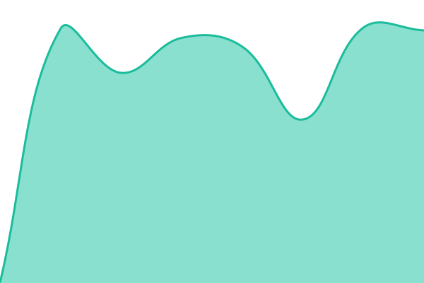
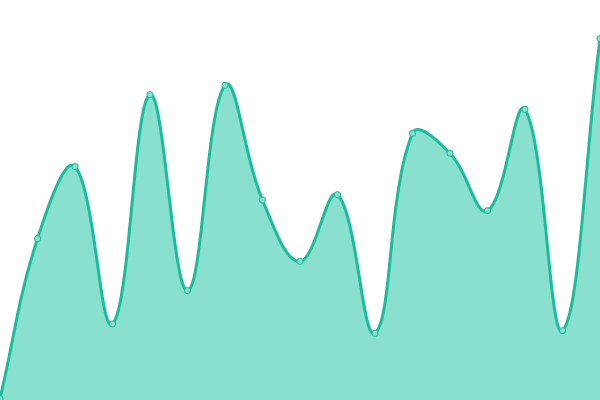
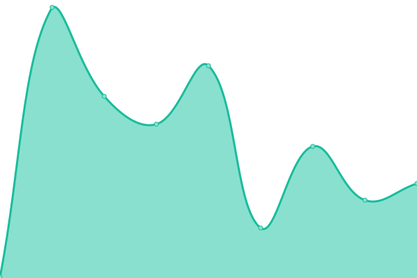

# [📈 Live Status](https://status.makeshapes.com): <!--live status--> **🟧 Partial outage**

This repository contains the open-source uptime monitor and status page for [Makeshapes](https://www.makeshapes.com/), powered by [Upptime](https://github.com/upptime/upptime).

With [Upptime](https://upptime.js.org), you can get your own unlimited and free uptime monitor and status page, powered entirely by a GitHub repository. We use [Issues](https://github.com/Makeshapes/status/issues) as incident reports, [Actions](https://github.com/Makeshapes/status/actions) as uptime monitors, and [Pages](https://status.makeshapes.com) for the status page.

<!--start: status pages-->
<!-- This summary is generated by Upptime (https://github.com/upptime/upptime) -->
<!-- Do not edit this manually, your changes will be overwritten -->
<!-- prettier-ignore -->
| URL | Status | History | Response Time | Uptime |
| --- | ------ | ------- | ------------- | ------ |
|  [API (apiv2)](https://does-not-exist.makeshapes.com/) | 🟥 Down | [api-apiv2.yml](https://github.com/Makeshapes/status/commits/HEAD/history/api-apiv2.yml) | 

 645ms
     
 | 

<a href="https://status.makeshapes.com/history/api-apiv2">99.38%</a>
    

|  [YJS (collab)](https://yjs.prod.makeshapes.com/v3/health) | 🟩 Up | [yjs-collab.yml](https://github.com/Makeshapes/status/commits/HEAD/history/yjs-collab.yml) | 

 621ms
     
 | 

<a href="https://status.makeshapes.com/history/yjs-collab">100.00%</a>
    

|  [Socket.IO (sessions)](https://socketio.prod.makeshapes.com/health) | 🟩 Up | [socket-io-sessions.yml](https://github.com/Makeshapes/status/commits/HEAD/history/socket-io-sessions.yml) | 

 626ms
     
 | 

<a href="https://status.makeshapes.com/history/socket-io-sessions">100.00%</a>
    

|  [Experience (app)](https://app.makeshapes.com) | 🟩 Up | [experience-app.yml](https://github.com/Makeshapes/status/commits/HEAD/history/experience-app.yml) | 

 136ms
     
 | 

<a href="https://status.makeshapes.com/history/experience-app">100.00%</a>
    

|  [Creator](https://creator.makeshapes.com) | 🟩 Up | [creator.yml](https://github.com/Makeshapes/status/commits/HEAD/history/creator.yml) | 

 160ms
     
 | 

<a href="https://status.makeshapes.com/history/creator">100.00%</a>
    

|  [SLACK TEST (delete me)](https://does-not-exist.makeshapes.com/) | 🟥 Down | [slack-test-delete-me.yml](https://github.com/Makeshapes/status/commits/HEAD/history/slack-test-delete-me.yml) | 

 631ms
     
 | 

<a href="https://status.makeshapes.com/history/slack-test-delete-me">0.00%</a>
    

<!--end: status pages-->

[**Visit our status website →**](https://status.makeshapes.com)

## 📄 License

- Powered by: [Upptime](https://github.com/upptime/upptime)
- Code: [MIT](./LICENSE) © [Anand Chowdhary](https://anandchowdhary.com), supported by [Pabio](https://pabio.com)
- Data in the `./history` directory: [Open Database License](https://opendatacommons.org/licenses/odbl/1-0/)
